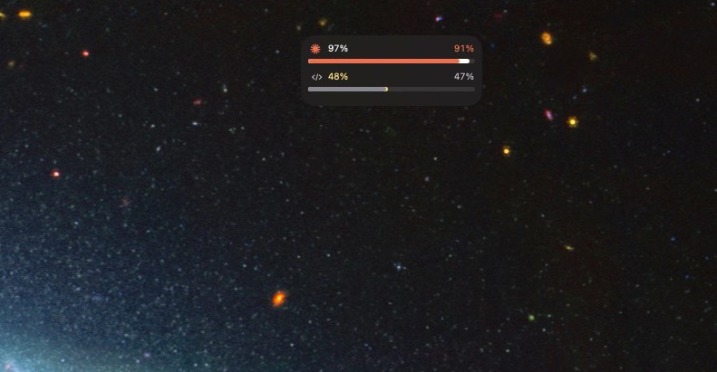
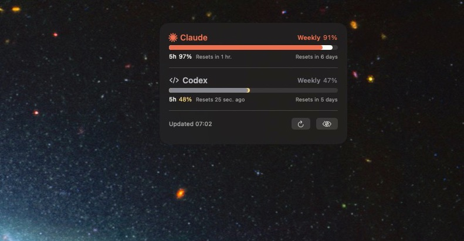

# potatoken hub

[한국어](#한국어) · [English](#english) · [日本語](#日本語) · [中文](#中文)

Claude와 Codex의 남은 사용량을 macOS 메뉴바에서 보여주는 로컬 전용 앱.

## 스크린샷

| 소형 창 | 대형 창 |
|---|---|
|  |  |

---

## 한국어

Mac에 이미 저장되어 있는 로컬 사용량 기록만 읽습니다. 계정, 분석 도구, 제공자 API 키가 없고
네트워크 통신도 하지 않습니다.

### 다운로드

[최신 릴리즈](https://github.com/bmminky/potatoken-hub/releases/latest)에서 DMG 또는 ZIP을 받으세요. Apple Silicon(`arm64`) 전용입니다.

1. DMG를 열고 `potatoken hub.app`을 Applications 폴더로 드래그하거나, ZIP을 풀어서 옮깁니다.
2. 처음 실행할 때 Finder에서 `potatoken hub.app`을 **우클릭 → 열기**로 실행하세요.
3. 그래도 막히면 시스템 설정 → 개인정보 보호 및 보안에서, 이 저장소에서 받은 파일이 맞는지 확인한 뒤 "확인 없이 열기"를 선택하세요.
4. 메뉴바에서 potatoken hub 게이지를 찾으세요 — Dock 아이콘은 의도적으로 없습니다.

서명 안내: 이 빌드는 애드혹 서명이며 Apple 공증을 받지 않았습니다(Developer ID 인증서가 없는 개인 프로젝트라서입니다). 그래서 처음 실행 시 Gatekeeper 경고가 뜹니다. Gatekeeper 우회를 원하지 않으면 아래 "빌드" 항목대로 소스에서 직접 빌드하세요.

**무결성 확인 (SHA-256)**

```
a494ab508797ab6821887bd02fd3424ced5acf1fee2d681edecd5b666f42f9c2  potatoken-hub-1.10.0-macOS-arm64.dmg
6fd1b6a8c904f38bfba39887443268b08304425d05b3110d2f386d416b8a63a6  potatoken-hub-1.10.0-macOS-arm64.zip
a6c3568558c873690b4746546df821ad53e519f825a7eb444e74c08de3a7651d  potatoken-hub-1.10.0-windows-x64.zip
```

macOS: `shasum -a 256 파일명` / Windows: `certutil -hashfile 파일명 SHA256`

### 기능

- **메뉴바 표시** — 각 제공자의 가장 빠듯한 남은 비율을 `Cl 74%  Cx 55%` 형태로 표시
- **두 가지 창 크기** — 창을 더블클릭하거나 우클릭 메뉴의 `창 크기`에서 전환
  - 소형: Claude/Codex 각각 한 줄 요약 + 사용량 막대
  - 대형: 창(5시간/주간/7일)별 상세 게이지, 리셋 예상 시각, 새로고침·숨기기
- **15초마다 자동 새로고침**
- **우클릭 메뉴** — 창 크기, 항상 위, 로그인 시 자동 실행 토글, 앱 종료
- **위치·크기 기억** — 창을 닫은 자리에 그대로 다시 열림
- **4개 언어** — 한국어·English·日本語·中文, 시스템 언어 자동 감지 또는 트레이 메뉴에서 수동 전환
- Dock 아이콘 없음 (`LSUIElement`)

### 데이터 출처

| 제공자 | 로컬 경로 | 비고 |
|---|---|---|
| Claude | `~/Library/Application Support/Claude/plan-usage-history.json` | 5시간·주간 사용률. 파일에 리셋 시각이 없어 과거 사용량이 급감한 지점으로 추정하며, 추정값은 `약`으로 표시 |
| Codex | `~/.codex/sessions/**/*.jsonl` | 가장 최근 `rate_limits` 기록. `resets_at`이 있어 리셋 시각이 정확함 |

두 파일 모두 읽기 전용으로 열며, 대화 내용은 읽지 않습니다.

### 요구 사항

- macOS 13 Ventura 이상
- Swift 6 툴체인 (`swift --version`)
- Xcode Command Line Tools

### 빌드

```bash
./Scripts/build-app.sh
ditto ".build/potatoken hub.app" "/Applications/potatoken hub.app"
open "/Applications/potatoken hub.app"
```

빌드 스크립트가 릴리스 바이너리 컴파일, 앱 번들 생성, 애드혹 서명, 검증까지 수행합니다.

`swift run`이 아니라 앱 번들로 실행해야 합니다 — 로그인 시 자동 실행에는 안정적인
번들 식별자가 필요합니다.

### 테스트

```bash
swift test
```

### 구조

| 경로 | 역할 |
|---|---|
| `Sources/TokenGaugeCore` | 파싱, 검증, 리셋 추정 등 테스트 가능한 로직 |
| `Sources/TokenGauge` | SwiftUI/AppKit 메뉴바 셸과 시스템 연동 |
| `Tests/TokenGaugeCoreTests` | 리셋 추정 로직 단위 테스트 |
| `Scripts/build-app.sh` | 릴리스 빌드, 번들 조립, 서명, 검증 |

### 참고

이 앱은 서명이 애드혹이고 Apple 공증을 받지 않았습니다. 개인용으로 직접 빌드해 쓰는 것을
전제로 합니다.

OpenAI, Anthropic과 무관한 개인 프로젝트입니다.

[↑ 언어 선택으로](#potatoken-hub)

---

## English

A local-only macOS menu bar app that shows your remaining Claude and Codex
usage. It only reads usage records already stored on your Mac — no accounts,
no analytics, no provider API keys, no network calls.

### Download

Get the DMG or ZIP from the [latest release](https://github.com/bmminky/potatoken-hub/releases/latest). Apple Silicon (`arm64`) only.

1. Open the DMG and drag `potatoken hub.app` into Applications, or unzip and move it there.
2. On first launch, **right-click `potatoken hub.app` in Finder and choose Open**.
3. If macOS still blocks it, go to System Settings → Privacy & Security and choose "Open Anyway" only after confirming you got it from this repository.
4. Look for the potatoken hub gauge in the menu bar — there's no Dock icon by design.

Signing notice: this build is ad-hoc signed and not notarized by Apple (a personal project without a Developer ID certificate), so Gatekeeper will warn on first launch. If you'd rather not override Gatekeeper, build from source using the instructions below.

**Integrity check (SHA-256)**

```
a494ab508797ab6821887bd02fd3424ced5acf1fee2d681edecd5b666f42f9c2  potatoken-hub-1.10.0-macOS-arm64.dmg
6fd1b6a8c904f38bfba39887443268b08304425d05b3110d2f386d416b8a63a6  potatoken-hub-1.10.0-macOS-arm64.zip
a6c3568558c873690b4746546df821ad53e519f825a7eb444e74c08de3a7651d  potatoken-hub-1.10.0-windows-x64.zip
```

macOS: `shasum -a 256 <file>` / Windows: `certutil -hashfile <file> SHA256`

### Features

- **Menu bar readout** — each provider's tightest remaining percentage, shown as `Cl 74%  Cx 55%`
- **Two panel sizes** — switch by double-clicking the window, or from `Window Size` in the right-click menu
  - Small: a one-line summary and usage bar per provider
  - Large: a detailed gauge per window (5h/weekly/7d), estimated reset time, refresh/hide
- **Auto-refresh every 15 seconds**
- **Right-click menu** — window size, always on top, toggle launch at login, quit
- **Remembers position and size** — reopens exactly where you left it
- **4 languages** — Korean/English/Japanese/Chinese, auto-detected from the system or switched manually from the tray menu
- No Dock icon (`LSUIElement`)

### Data sources

| Provider | Local path | Notes |
|---|---|---|
| Claude | `~/Library/Application Support/Claude/plan-usage-history.json` | 5-hour and weekly usage. The file has no reset timestamp, so it's estimated from where past usage dropped sharply — estimated values are marked "(est.)" |
| Codex | `~/.codex/sessions/**/*.jsonl` | The most recent `rate_limits` record. `resets_at` is present, so the reset time is exact |

Both files are opened read-only; conversation content is never read.

### Requirements

- macOS 13 Ventura or later
- Swift 6 toolchain (`swift --version`)
- Xcode Command Line Tools

### Build

```bash
./Scripts/build-app.sh
ditto ".build/potatoken hub.app" "/Applications/potatoken hub.app"
open "/Applications/potatoken hub.app"
```

The build script compiles the release binary, assembles the app bundle, ad-hoc signs it, and verifies it.

Run it as the app bundle, not `swift run` — launch-at-login needs a stable bundle identifier.

### Tests

```bash
swift test
```

### Layout

| Path | Role |
|---|---|
| `Sources/TokenGaugeCore` | Parsing, validation, reset estimation — the testable logic |
| `Sources/TokenGauge` | The SwiftUI/AppKit menu bar shell and system integration |
| `Tests/TokenGaugeCoreTests` | Unit tests for the reset estimation logic |
| `Scripts/build-app.sh` | Release build, bundle assembly, signing, verification |

### Note

This app is ad-hoc signed and not notarized by Apple. It's meant to be built and run locally for personal use.

An independent personal project, unaffiliated with OpenAI or Anthropic.

[↑ Back to language picker](#potatoken-hub)

---

## 日本語

Mac にすでに保存されているローカルの使用量記録だけを読み取るローカル専用アプリです。
アカウント、分析ツール、プロバイダーの API キーはなく、ネットワーク通信も行いません。

### ダウンロード

[最新リリース](https://github.com/bmminky/potatoken-hub/releases/latest)から DMG または ZIP を入手してください。Apple Silicon(`arm64`)専用です。

1. DMG を開いて `potatoken hub.app` を Applications フォルダにドラッグするか、ZIP を展開して移動します。
2. 初回起動時は Finder で `potatoken hub.app` を**右クリック → 開く**で起動してください。
3. それでもブロックされる場合は、システム設定 → プライバシーとセキュリティで、このリポジトリから入手したことを確認したうえで「このまま開く」を選択してください。
4. メニューバーで potatoken hub のゲージを探してください — Dock アイコンは意図的にありません。

署名について: このビルドはアドホック署名のみで、Apple の公証は受けていません(Developer ID 証明書のない個人プロジェクトのため)。そのため初回起動時に Gatekeeper の警告が出ます。Gatekeeper を回避したくない場合は、下記の手順でソースからビルドしてください。

**整合性確認(SHA-256)**

```
a494ab508797ab6821887bd02fd3424ced5acf1fee2d681edecd5b666f42f9c2  potatoken-hub-1.10.0-macOS-arm64.dmg
6fd1b6a8c904f38bfba39887443268b08304425d05b3110d2f386d416b8a63a6  potatoken-hub-1.10.0-macOS-arm64.zip
a6c3568558c873690b4746546df821ad53e519f825a7eb444e74c08de3a7651d  potatoken-hub-1.10.0-windows-x64.zip
```

macOS: `shasum -a 256 ファイル名` / Windows: `certutil -hashfile ファイル名 SHA256`

### 機能

- **メニューバー表示** — 各プロバイダーの最も逼迫した残り割合を `Cl 74%  Cx 55%` の形式で表示
- **2種類のウィンドウサイズ** — ウィンドウをダブルクリックするか、右クリックメニューの「ウインドウサイズ」で切り替え
  - 小: Claude/Codex それぞれ1行の要約と使用量バー
  - 大: ウィンドウ(5時間/週間/7日)ごとの詳細ゲージ、リセット予想時刻、更新・非表示
- **15秒ごとに自動更新**
- **右クリックメニュー** — ウインドウサイズ、常に手前に表示、ログイン時の自動起動の切り替え、アプリ終了
- **位置・サイズを記憶** — 閉じた場所にそのまま再度開く
- **4言語対応** — 한国語・English・日本語・中文、システム言語の自動検出またはトレイメニューから手動切り替え
- Dock アイコンなし (`LSUIElement`)

### データソース

| プロバイダー | ローカルパス | 備考 |
|---|---|---|
| Claude | `~/Library/Application Support/Claude/plan-usage-history.json` | 5時間・週間の使用率。ファイルにリセット時刻がないため、過去の使用量が急減した地点から推定し、推定値には「約」を表示 |
| Codex | `~/.codex/sessions/**/*.jsonl` | 直近の `rate_limits` 記録。`resets_at` があるためリセット時刻は正確 |

両ファイルとも読み取り専用で開き、会話内容は読み取りません。

### 動作要件

- macOS 13 Ventura 以降
- Swift 6 ツールチェーン (`swift --version`)
- Xcode Command Line Tools

### ビルド

```bash
./Scripts/build-app.sh
ditto ".build/potatoken hub.app" "/Applications/potatoken hub.app"
open "/Applications/potatoken hub.app"
```

ビルドスクリプトがリリースバイナリのコンパイル、アプリバンドルの組み立て、アドホック署名、検証まで行います。

`swift run` ではなくアプリバンドルとして実行してください — ログイン時自動起動には
安定したバンドル識別子が必要です。

### テスト

```bash
swift test
```

### 構成

| パス | 役割 |
|---|---|
| `Sources/TokenGaugeCore` | パース、検証、リセット推定などテスト可能なロジック |
| `Sources/TokenGauge` | SwiftUI/AppKit のメニューバーシェルとシステム連携 |
| `Tests/TokenGaugeCoreTests` | リセット推定ロジックの単体テスト |
| `Scripts/build-app.sh` | リリースビルド、バンドル組み立て、署名、検証 |

### 補足

このアプリはアドホック署名のみで、Apple の公証は受けていません。個人用にローカルで
ビルドして使うことを前提としています。

OpenAI、Anthropic とは無関係の個人プロジェクトです。

[↑ 言語選択に戻る](#potatoken-hub)

---

## 中文

只读取 Mac 上已经保存的本地使用量记录的本地专用应用。没有账户、没有分析工具、没有
服务商 API 密钥,也不进行任何网络通信。

### 下载

从[最新版本](https://github.com/bmminky/potatoken-hub/releases/latest)获取 DMG 或 ZIP。仅支持 Apple Silicon(`arm64`)。

1. 打开 DMG,将 `potatoken hub.app` 拖入 Applications 文件夹;或解压 ZIP 后手动移动过去。
2. 首次启动时,在 Finder 中**右键点击 `potatoken hub.app` → 打开**。
3. 如果 macOS 仍然阻止运行,请前往系统设置 → 隐私与安全性,在确认文件确实来自本仓库后选择"仍要打开"。
4. 在菜单栏中寻找 potatoken hub 的进度图标 —— 该应用刻意不提供 Dock 图标。

签名说明:该构建仅进行了临时签名(ad-hoc),未经 Apple 公证(个人项目,没有 Developer ID 证书),因此首次启动时会出现 Gatekeeper 警告。如果不想绕过 Gatekeeper,可按下方说明自行从源码构建。

**完整性校验(SHA-256)**

```
a494ab508797ab6821887bd02fd3424ced5acf1fee2d681edecd5b666f42f9c2  potatoken-hub-1.10.0-macOS-arm64.dmg
6fd1b6a8c904f38bfba39887443268b08304425d05b3110d2f386d416b8a63a6  potatoken-hub-1.10.0-macOS-arm64.zip
a6c3568558c873690b4746546df821ad53e519f825a7eb444e74c08de3a7651d  potatoken-hub-1.10.0-windows-x64.zip
```

macOS: `shasum -a 256 文件名` / Windows: `certutil -hashfile 文件名 SHA256`

### 功能

- **菜单栏显示** — 以 `Cl 74%  Cx 55%` 的形式显示各服务商最紧张的剩余比例
- **两种窗口尺寸** — 双击窗口,或在右键菜单的「窗口大小」中切换
  - 小尺寸:Claude/Codex 各一行摘要 + 使用量条
  - 大尺寸:每个窗口(5小时/每周/7天)的详细进度条、预计重置时间、刷新/隐藏
- **每15秒自动刷新**
- **右键菜单** — 窗口大小、总在最前、切换开机自启动、退出应用
- **记住位置和大小** — 关闭后下次在原位置重新打开
- **支持4种语言** — 한国语·English·日本语·中文,自动检测系统语言,或在托盘菜单中手动切换
- 无 Dock 图标 (`LSUIElement`)

### 数据来源

| 服务商 | 本地路径 | 备注 |
|---|---|---|
| Claude | `~/Library/Application Support/Claude/plan-usage-history.json` | 5小时·每周使用率。文件中没有重置时间戳,因此根据历史使用量骤降的位置进行估算,估算值会标注"大约" |
| Codex | `~/.codex/sessions/**/*.jsonl` | 最近一次的 `rate_limits` 记录。因为存在 `resets_at`,重置时间是精确的 |

两个文件都以只读方式打开,不会读取对话内容。

### 系统要求

- macOS 13 Ventura 或更高版本
- Swift 6 工具链 (`swift --version`)
- Xcode Command Line Tools

### 构建

```bash
./Scripts/build-app.sh
ditto ".build/potatoken hub.app" "/Applications/potatoken hub.app"
open "/Applications/potatoken hub.app"
```

构建脚本会完成发布版二进制编译、应用包组装、临时签名(ad-hoc)以及验证。

请以应用包的形式运行,而不是用 `swift run` —— 开机自启动需要稳定的
应用包标识符。

### 测试

```bash
swift test
```

### 项目结构

| 路径 | 作用 |
|---|---|
| `Sources/TokenGaugeCore` | 解析、校验、重置时间估算等可测试逻辑 |
| `Sources/TokenGauge` | SwiftUI/AppKit 菜单栏外壳与系统集成 |
| `Tests/TokenGaugeCoreTests` | 重置估算逻辑的单元测试 |
| `Scripts/build-app.sh` | 发布构建、应用包组装、签名、验证 |

### 说明

本应用仅进行临时签名(ad-hoc),未经过 Apple 公证。默认前提是自行本地构建后
个人使用。

与 OpenAI、Anthropic 无关的个人项目。

[↑ 返回语言选择](#potatoken-hub)
